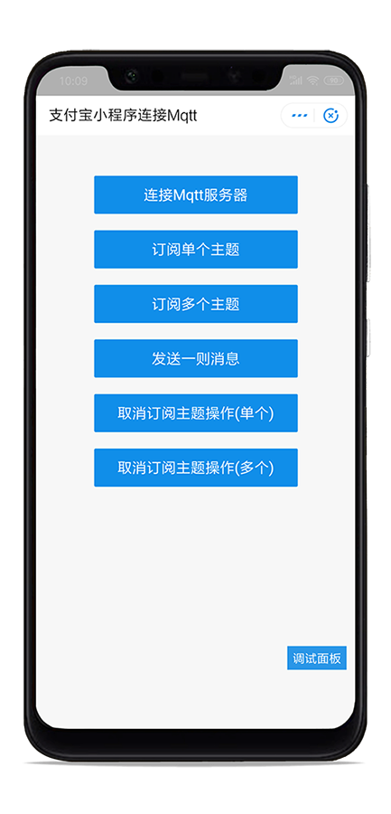
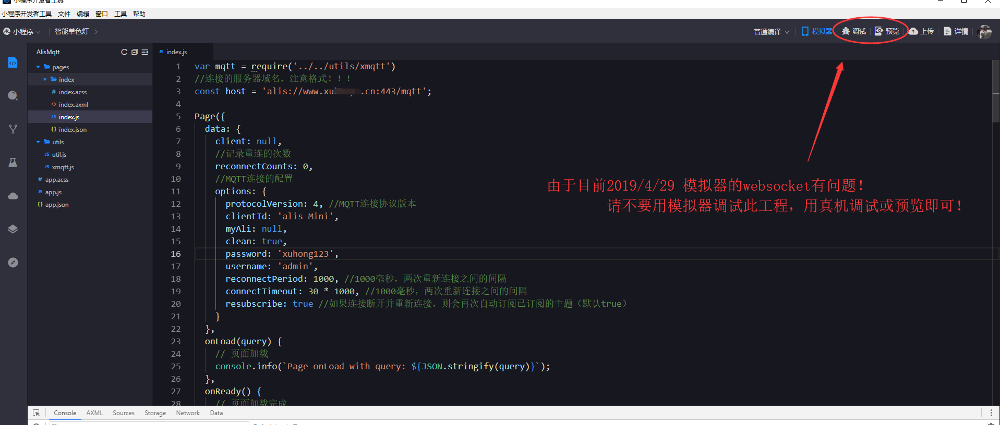
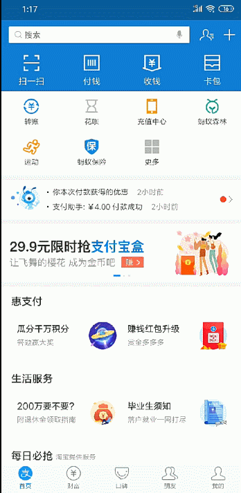

# AlisMiniMqttEsp8266


<p align="center">
  
</p>
 

## 一、前言

  - 这是一个开源的可连接**Mqtt服务器**的```xmqtt.js```的代码工程，本工程的配置文件如下图所示```index.js```，在里面修改为您的搭建好的MQTT服务器以及想要订阅的主题，想要连接更多关于支付宝小程序控制智能硬件（包括```esp8266、esp32```）说明，稍后呈现！
  

  
## 二、版本迭代
|版本|更新说明|更新时间|
| :---- | :---- | :----- | 
|1|首次提交|2019-4-29|
## 三、特别注意

  - 还是要特别提醒，支付宝小程序没有像微信小程序那样对 ```websocket```要求指定的端口，所以我们可以用我们之前在微信小程序连接成功的服务器备用！连接格式：```alis:www.domain.com/mqtt```，可有可无端口号！
  - 鉴于目前 2019-4-29 官网的开发工具的模拟器的 ```websocket``` 收发数据有问题，所以调试此工程请切记切记预览或调试运行在真机上！！！请勿在模拟器运行，如果成功连接提示，那么应该是官网修复了！
  - 移植和**二次修改**来自 https://github.com/mqttjs/MQTT.js 更多使用技巧访问其使用文档！或者阅读我本仓库提供的代码！共勉！
 
 ## 四、加群将免费提供服务器连接测试！
 
   - 福利多多，请加QQ群：434878850

## 五、工程截图
 
 
 
 ## 六、连接效果图
 
 <p align="center">
  
</p>


